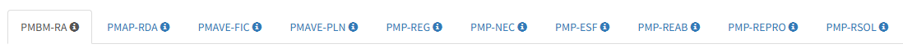

- build silver task group
- build gold task group

- remember the bandar report link is https://libgeo.univali.br/bandar/report

- difference between triger and data interval timetables https://airflow.apache.org/docs/apache-airflow/stable/authoring-and-scheduling/timetable.html#differences-between-trigger-and-data-interval-timetables